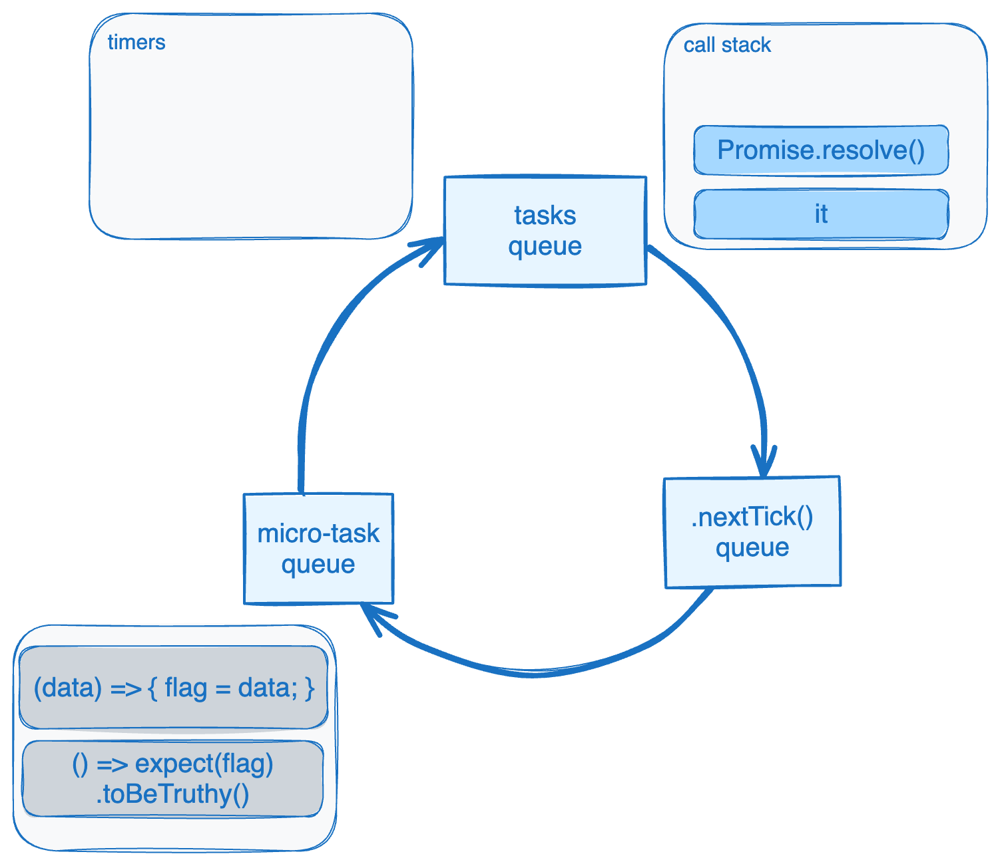

# W(iar)ygodne testy w asynchronicznym świecie

## Artur Wolny

---

# Kim jestem


##### ||| Senior developer w FrontEgg
 

##### ||| Podcaster w Artistry of Code


---

# Cechy wiarygodnych testów

**DETERMINISTYCZNE** :  każde wykonanie testu daje taki sam wynik

**KOMPLETNE** :  pokrywają każdy możliwy przypadek użycia  
(ale niekoniecznie oznaczają 100% pokrycie kodu)

# Cechy wygodnych testów
**SZYBKIE** :  czas wykonania mierzymy w sekundach

**ZROZUMIAŁE** :  czytając opis testu, poznajemy zachowania kodu

---

# Nasz developer Jacek - zaczyna od PHP

```php
$client = new Client([
    'base_uri' => BASE_URL,
]);

$response = $client->request('GET', '/', $requestData);
$data = unserialize($response->getBody()->getContents());
```

gdzie kod wykonywany jest sekwencyjnie

---

A tak wygląda asynchroniczny świat JS:

```typescript
const baz = () => console.log('baz');
const foo = () => console.log('foo');
const zoo = () => console.log('zoo');

console.log('start');

setImmediate(baz);

new Promise((resolve, reject) => {
    resolve('bar');
}).then(resolve => {
    console.log(resolve);
    process.nextTick(zoo);
});

process.nextTick(foo);

// line by line:        start baz bar zoo foo 
// actual:              start foo bar zoo baz
```

--- 

# Uproszczony Event Loop


<!--
* ilustracja przedstawia uproszczony model Event Loop'a
* trzy kolejki między którymi NodeJS się przełącza
* kod wykonywany jest, aż kolejka jest opróżniona
PATRZAC OD GÓRY:
* taski to synchroniczne kawałki kodu, które Node może wykonać w ciągu
* callbacki zarejestrowane w kodzie 
-->
---

# Event-Loop'owa "gwiazda śmierci"


---

# Sytuacja 1.
## Testowanie funkcji bazujących na timerach

---

Jacek chce przetestować funkcję:
```typescript
let flag = false;

function switchingFlagThatTakes10sec(): void {
    setTimeout(() => { flag = true }, 10_000);
}
```

---

Jak zrobić to najprościej?

```typescript
it("when I wait, I have working test :)", async () => {
    // given: operation started
    switchingFlagThatTakes10sec();

    // when: 10 sec elapsed
    await sleep(10_100);

    // then
    expect(flag).toBeTruthy();
});
```
wynik:
```bash
➜  meetjs-2023-11-30 git:(main) ✗ npx jest -t "#0.0" --silent
 PASS  test/#0.timeouts.spec.ts (10.826 s)

Test Suites: 1 passed, 1 total
Tests:       2 skipped, 1 passed, 3 total
Snapshots:   0 total
Time:        10.873 s
```
---
### 10 sekund...


---
### Jest fake timers na ratunek!
```typescript
    it('but I can also make it quick', () => {
        // prepare: mock timers
        jest.useFakeTimers();

        // given: operation started
        switchingFlagThatTakes10sec();

        // when: we pretend 10 sec elapsed
        jest.advanceTimersByTime(10_100);

        // then: it's gonna be okay :)
        expect(flag).toBeTruthy();
    });
```
wynik:
```bash
➜  meetjs-2023-11-30 git:(main) ✗ npx jest -t "#0.1.1" --verbose
 PASS  test/#0.timeouts.spec.ts
  #0: Given we have timer-based operation that produces side effect (swaps flag)
    #0.1: and we dont really want to wait that long..
      ✓ #0.1.1: if switching flag in synchronous, then it is fairly easy to mock timers with Jest. (2 ms)
```

---

Co jednak, jeśli timer wywołuje asynchroniczną funkcję?  
```typescript
function pollData(): void {
    setTimeout(async () => {
        // let's say it's polling the data
        let data = await Promise.resolve(true); 

        flag = data;
    }, 10_000);
}
```

---

Jeśli Jacek spróbuje zrobić kopiuj/wklej i podmieni tylko testowaną funkcję..
```typescript
it('#0.1.2: but what if switching flag is asynchronous?..', () => {
    // prepare: mock timers
    jest.useFakeTimers();

    // given: operation started
    pollData();

    // when: 10 sec elapsed
    jest.advanceTimersByTime(10_100);

    // then
    expect(flag).toBeTruthy(); 
});
```

...czy to zadziała?

---

```bash
➜  meetjs-2023-11-30 git:(main) ✗ npx jest -t "#0.1.2" --verbose
 FAIL  test/#0.timeouts.spec.ts
  #0: Given we have timer-based operation that produces side effect (swaps flag)
    #0.1: and we dont really want to wait that long..
      ✕ #0.1.2: but what if switching flag is asynchronous?.. (3 ms)

```

--- 

## Szukamy przyczyny!

---

Spójrzmy na testowaną funkcję jeszcze raz:
```typescript
function pollData(): void {
    setTimeout(async () => {
        // let's say it's polling the data
        let data = await Promise.resolve(true); 

        flag = data;
    }, 10_000);
}
```
oraz na jej inną formę:
```typescript
function pollData(): void {
    setTimeout(() => {
        Promise.resolve(true)
            .then((data) => {
                flag = data;
            });
    }, 10_000);
}
```


---
```typescript
Promise.resolve(true)
    .then((data) => {
        flag = data;
    });

```


Widzimy tutaj: 
```typescript
Promise.resolve(true)
``` 
oraz callback, który zostanie dodany do kolejki mikro-tasków:
```typescript
(data) => { flag = data; }
```

---


# Spójrzmy jeszcze raz na Event-Loop

```typescript
    function pollData(): void {
        setTimeout(() => {
            Promise.resolve(true)
                .then((data) => {
                    flag = data;
                });
        }, 10_000);
    }

    it('#0.1.2: ...', () => {
        // prepare: mock timers
        jest.useFakeTimers();

        // given: operation started
***     pollData();

        // when: 10 sec elapsed
        jest.advanceTimersByTime(10_100);

        // then
        expect(flag).toBeTruthy(); 
    });
```
---


# Spójrzmy jeszcze raz na Event-Loop

```typescript
    function pollData(): void {
***     setTimeout(() => {
            Promise.resolve(true)
                .then((data) => {
                    flag = data;
                });
        }, 10_000);
    }

    it('#0.1.2: ...', () => {
        // prepare: mock timers
        jest.useFakeTimers();

        // given: operation started
        pollData();

        // when: 10 sec elapsed
        jest.advanceTimersByTime(10_100);

        // then
        expect(flag).toBeTruthy(); 
    });
```

---


# Spójrzmy jeszcze raz na Event-Loop

```typescript
    function pollData(): void {
        setTimeout(() => {
            Promise.resolve(true)
                .then((data) => {
                    flag = data;
                });
        }, 10_000);
    }

    it('#0.1.2: ...', () => {
        // prepare: mock timers
        jest.useFakeTimers();

        // given: operation started
        pollData();

        // when: 10 sec elapsed
***     jest.advanceTimersByTime(10_100);

        // then
        expect(flag).toBeTruthy(); 
    });
```
---


# Spójrzmy jeszcze raz na Event-Loop

```typescript
    function pollData(): void {
        setTimeout(() => {
***         Promise.resolve(true)
                .then((data) => {
                    flag = data;
                });
        }, 10_000);
    }

    it('#0.1.2: ...', () => {
        // prepare: mock timers
        jest.useFakeTimers();

        // given: operation started
        pollData();

        // when: 10 sec elapsed
        jest.advanceTimersByTime(10_100);

        // then
        expect(flag).toBeTruthy(); 
    });
```

---


# Spójrzmy jeszcze raz na Event-Loop

```typescript
    function pollData(): void {
        setTimeout(() => {
            Promise.resolve(true)
                .then((data) => {
                    flag = data;
                });
        }, 10_000);
    }

    it('#0.1.2: ...', () => {
        // prepare: mock timers
        jest.useFakeTimers();

        // given: operation started
        pollData();

        // when: 10 sec elapsed
        jest.advanceTimersByTime(10_100);

        // then
***     expect(flag).toBeTruthy(); 
    });
```
---

### Asercja wykonała się PRZED callbackiem!

(brzydkie) rozwiązanie może wyglądać tak:
```typescript
it('#0.1.3: we can solve it ugly way', async () => {
    // prepare: mock timers
    jest.useFakeTimers();

    // given: operation started
    pollData();

    // when: 10 sec elapsed
    jest.advanceTimersByTime(10_100);
    
    // SIC!
    await Promise.resolve();

    // then: this is going to work again!
    expect(flag).toBeTruthy(); 
});
```

---


# Jak teraz wygląda sekwencja wywołań?

```typescript
    function pollData(): void {
        setTimeout(() => {
            Promise.resolve(true)
                .then((data) => {
                    flag = data;
                });
        }, 10_000);
    }

    it('#0.1.2: ...', () => {
        // prepare: mock timers
        jest.useFakeTimers();

        // given: operation started
***     pollData();

        // when: 10 sec elapsed
        jest.advanceTimersByTime(10_100);
    
        // SIC!
        await Promise.resolve();

        // then
        expect(flag).toBeTruthy(); 
    });
```
---


# Jak teraz wygląda sekwencja wywołań?

```typescript
    function pollData(): void {
***     setTimeout(() => {
            Promise.resolve(true)
                .then((data) => {
                    flag = data;
                });
        }, 10_000);
    }

    it('#0.1.2: ...', () => {
        // prepare: mock timers
        jest.useFakeTimers();

        // given: operation started
        pollData();

        // when: 10 sec elapsed
        jest.advanceTimersByTime(10_100);

        // SIC!
        await Promise.resolve();

        // then
        expect(flag).toBeTruthy(); 
    });
```

---


# Jak teraz wygląda sekwencja wywołań?

```typescript
    function pollData(): void {
        setTimeout(() => {
            Promise.resolve(true)
                .then((data) => {
                    flag = data;
                });
        }, 10_000);
    }

    it('#0.1.2: ...', () => {
        // prepare: mock timers
        jest.useFakeTimers();

        // given: operation started
        pollData();

        // when: 10 sec elapsed
***     jest.advanceTimersByTime(10_100);

        // SIC!
        await Promise.resolve();

        // then
        expect(flag).toBeTruthy(); 
    });
```
---


# Jak teraz wygląda sekwencja wywołań?

```typescript
    function pollData(): void {
        setTimeout(() => {
***         Promise.resolve(true)
                .then((data) => {
                    flag = data;
                });
        }, 10_000);
    }

    it('#0.1.2: ...', () => {
        // prepare: mock timers
        jest.useFakeTimers();

        // given: operation started
        pollData();

        // when: 10 sec elapsed
        jest.advanceTimersByTime(10_100);

        // SIC!
        await Promise.resolve();

        // then
        expect(flag).toBeTruthy(); 
    });
```

---


# Jak teraz wygląda sekwencja wywołań?

```typescript
    function pollData(): void {
        setTimeout(() => {
            Promise.resolve(true)
                .then((data) => {
                    flag = data;
                });
        }, 10_000);
    }

    it('#0.1.2: ...', () => {
        // prepare: mock timers
        jest.useFakeTimers();

        // given: operation started
        pollData();

        // when: 10 sec elapsed
        jest.advanceTimersByTime(10_100);
    
        // SIC!
***     await Promise.resolve();

        // then
        expect(flag).toBeTruthy(); 
    });
```

---


# Jak teraz wygląda sekwencja wywołań?

```typescript
    function pollData(): void {
        setTimeout(() => {
            Promise.resolve(true)
                .then((data) => {
***                 flag = data;
                });
        }, 10_000);
    }

    it('#0.1.2: ...', () => {
        // prepare: mock timers
        jest.useFakeTimers();

        // given: operation started
        pollData();

        // when: 10 sec elapsed
        jest.advanceTimersByTime(10_100);

    
        // SIC!
        await Promise.resolve();

        // then
        expect(flag).toBeTruthy(); 
    });
```

---


# Jak teraz wygląda sekwencja wywołań?

```typescript
    function pollData(): void {
        setTimeout(() => {
            Promise.resolve(true)
                .then((data) => {
                    flag = data;
                });
        }, 10_000);
    }

    it('#0.1.2: ...', () => {
        // prepare: mock timers
        jest.useFakeTimers();

        // given: operation started
        pollData();

        // when: 10 sec elapsed
        jest.advanceTimersByTime(10_100);

    
        // SIC!
        await Promise.resolve();

        // then
***     expect(flag).toBeTruthy(); 
    });
```

---


---

Dodatkowo, jeśli szczegóły implementacji funkcji się zmienią:
```typescript
function pollData(): void {
    setTimeout(async () => {
        sleep(5_000)
            .then(() => Promise.resolve(true))
            .then((data) => {
                flag = data;
            });
    }, 5_000);
}
```

To nasz test przestanie działać:
```
➜  meetjs-2023-11-30 git:(main) ✗ npx jest -t '"ugly way"' --verbose
 FAIL  test/#0.timeouts.spec.ts
  #0: Given we have timer-based operation that produces side effect (swaps flag)
    #0.1: and we dont really want to wait that long..
      #0.1.4: but what if our operation is promise chain?
        ✕ will "ugly way" work? (3 ms)
```

---

## Jest nie radzi sobie za dobrze z Promise'ami w timerach...

--- 


---

### Sinon.JS na ratunek!


```typescript
import { SinonFakeTimers, useFakeTimers } from "sinon";

it('then fake timers work well and fast', async () => {
    // prepare: fake timers
    const clock = useFakeTimers();

    // given: operation started
    pollData()

    // when: we pretend 10 sec elapsed
    await clock.tickAsync(10_100);

    // then
    expect(flag).toBeTruthy();
});
```
--- 

```
➜  meetjs-2023-11-30 git:(main) ✗ npx jest -t 'with Sinon' --verbose
 PASS  test/#0.timeouts.spec.ts
  #0: Given we have timer-based operation that produces side effect (swaps flag)
    #0.1: and we dont really want to wait that long..
      #0.1.4: but what if our operation is promise chain?
        with SinonJS
          ✓ then fake timers work well and fast (6 ms)
```


---

# Sytuacja 2: Testy integracyjne z asynchronicznym I/O

---
Rozważmy następujący scenariusz: 
```gherkin
Scenario: Calling business logic by the queue consumer

Given   there is a queue with consumer 
When    the message "foo" is published to queue
And     the consumer consumed message
Then    business logic is called with "foo"
```

---
Możemy go zasymulować używając prostej implementacji `Consumer`:
```typescript
class Consumer {
    constructor(
        private readonly businessLogic: (msg: string) => void
    ) {}

    consume(msg: string) {
        this.businessLogic(msg);
    }
}
```

oraz `Producer`:
```typescript
function Producer(consumer: Consumer): (msg: string) => void {
    return (msg: string): void => {
        sleep(avgTime())
            .then(() => consumer.consume(msg));
    }
}
```
---

Naiwna, prosta wersja tego testu może wyglądać tak:
```typescript
it('"naive" integration test', async () => {
    // given: there is a queue with consumer
    const businessLogic = jest.fn();
    const consumer = new Consumer(businessLogic);

    // when: the message is published to queue
    Producer(consumer)('foo');

    // and: consumer consumed message
    await sleep(10_000);

    // then: the message content is passed to "business logic"
    expect(businessLogic).toHaveBeenCalledWith('foo');
});
```

---

Jedna linijka:
```typescript
    // and: consumer consumed message
    await sleep(10_000);
```
wystarczy, żeby testy nie były ani **wiarygodne** (determinizm), ani **wygodne** (szybkość).

---

Ponieważ cały proces może trwać od 1 do 11 sekund!
```typescript
function avgTime(): number { 
    return (Math.random() * 10_000) + 1_000;
}

function Producer(consumer: Consumer): (msg: string) => void {
    return (msg: string): void => {
        sleep(avgTime())
            .then(() => consumer.consume(msg));
    }
}
```

### Statystycznie aż 1 na 10 testów zakończy się niepowodzeniem!!

--- 

Jednak możemy być sprytni:
```typescript
import retry from "async-retry";

it('retry-async integration test', async () => {
    // given: consumer is started
    const businessLogic = jest.fn();
    const consumer = new Consumer(businessLogic);

    // when: the message is produced
    Producer(consumer)('foo');

    // then
    await retry(async () => {
        expect(businessLogic).toHaveBeenCalledWith('foo');
    }, { 
        maxRetryTime: 20_000, 
        minTimeout: 500, 
        factor: 1 
    });
});
```
---
Raz wolniej:
```bash
➜  meetjs-2023-11-30 git:(main) ✗ npx jest -t "retry-async" --verbose
 PASS  test/p2.retry.spec.ts (10.771 s)
  S2: Handling asynchronous integration tests
    ✓ retry-async integration test (9750 ms)
```
Raz szybciej:
```bash
➜  meetjs-2023-11-30 git:(main) ✗ npx jest -t "retry-async" --verbose
 PASS  test/p2.retry.spec.ts
  S2: Handling asynchronous integration tests
    ✓ retry-async integration test (1707 ms)
```

```bash
➜  meetjs-2023-11-30 git:(main) ✗ npx jest -t "retry-async" --verbose
 PASS  test/p2.retry.spec.ts (6.384 s)
  S2: Handling asynchronous integration tests
    ✓ retry-async integration test (5397 ms)
```


---

# Bonus 1: Przejęcie kontroli nad Promise'ami

---

```typescript
class ResolvedCollector {
    resolved: Promise<unknown>[] = [];

    collect<T>(promise: Promise<T>): void {
        promise.then(
            () => this.resolved.push(promise) 
        );
    }

    getResolved() {
        return this.resolved;
    }
}
```

---

Mogę sprawdzić mój kod używając `Promise.resolve`:
```typescript
it("it's easy to test that with Promise.resolve", async () => {
    const collector = new ResolvedCollector();
    
    // given
    const resolved = Promise.resolve();
    
    // when
    collector.collect(resolved);

    // and
    await resolved;

    // then
    expect(collector.getResolved()).toContain(resolved);            
});
```

---

oraz `Promise.reject`:
```typescript
it("little harder with Promise.rejected", async () => {
    const collector = new ResolvedCollector();
    
    // given
    const rejected = Promise.reject();
    
    // when
    collector.collect(rejected);

    // and
    await rejected.catch(() => {});

    // then
    expect(collector.getResolved()).not.toContain(rejected);            
});
```

---

Ale `defer<T>()` jest znacznie wygodniejsze:
```typescript
import { defer } from "@johanblumenberg/ts-mockito";

it("and ultimately with defer()", async () => {
    const collector = new ResolvedCollector();
    
    // given
    const deferredPromise = defer<void>();
    
    // when
    collector.collect(deferredPromise);

    // then
    expect(collector.getResolved()).not.toContain(deferredPromise);            

    // when
    await deferredPromise.resolve();

    // then
    expect(collector.getResolved()).toContain(deferredPromise);            
});
```

---


# Złote myśli

### Myśl #1 
Używaj fake-timerów, życie jest zbyt krótkie by czekać na powolne testy.

### Myśl #2:
Testy integracyjne asynchronicznych systemów zasługują na porządny `async-retry`.

### Myśl #3:
Da się żyć bez `DeferredPromise`, ale po co?

---

# Dziękuję za uwagę!


# Pytania?
